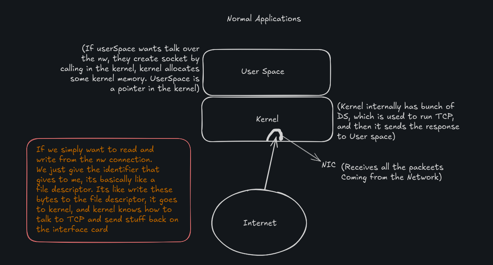
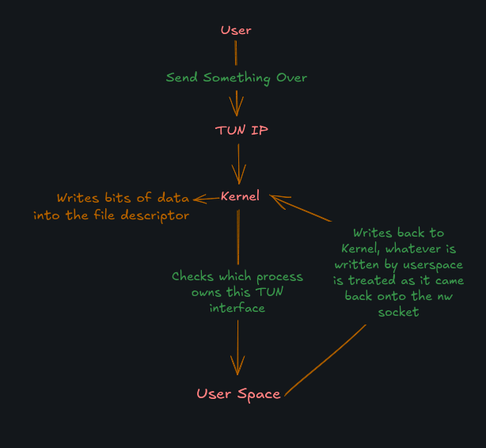
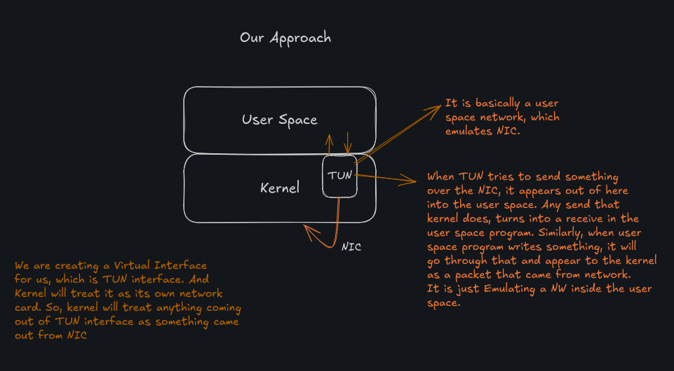

## TCP/IP Stack
- TCP is the fundamental protocol of internet, that enables two different hosts on the internet to talk to one another in a reliable way so that you can send data in such a way that we are guaranteed to not loose anything that we had sent and that the receiver receives things on the same order we had sent them.
- TCP/IP is a suite of communication protocols used to interconnect network devices on the internet. TCP/IP can also be used as a communications protocol in a private network (an intranet or an extranet).
- TCP/IP is a two-layer program. The higher layer, Transmission Control Protocol (TCP), manages the assembling of a message or file into smaller packets that are transmitted over the internet and received by a TCP layer that reassembles the packets into the original message. The lower layer, Internet Protocol (IP), handles the address part of each packet so that it gets to the right destination. Each gateway computer on the network checks this address to see where to forward the message. Even though some packets from the same message are routed differently than others, they'll be reassembled at the destination.
- TCP/IP uses the client/server model of communication in which a computer user (a client) requests and is provided a service (such as sending a Web page) by another computer (a server) in the network. TCP/IP communication is primarily point-to-point, meaning each communication is from one point (or host computer) in the network to another point or host computer. TCP/IP and the higher-level applications that use it are collectively said to be "connectionless" because each client request is considered a new request unrelated to any previous one (unlike ordinary phone conversations that require a dedicated connection for the call duration). Being connectionless, TCP/IP is also "stateless." The client request is considered a new one, and not a follow-up to a previous request the server may remember.
- TCP/IP is a stream oriented protocol, which means that it is a continuous stream of data, and it is up to the application to decide where one message ends and another begins. It is the responsibility of the application to decide where one message ends and another begins. TCP/IP is a connection oriented protocol, which means that it is a connection between two hosts, and it is a reliable protocol, which means that it guarantees that the data will be delivered to the other end, and it will be delivered in the same order that it was sent.
- TCP/IP is a reliable protocol, which means that it guarantees that the data will be delivered to the other end, and it will be delivered in the same order that it was sent. It is a connection oriented protocol, which means that it is a connection between two hosts. It is a stream oriented protocol, which means that it is a continuous stream of data, and it is up to the application to decide where one message ends and another begins.

I am going to make this compatible to other TCP impls, if we are able to talk to other TCP impl, then its the goal acheived for this project.

I will be referencing to RFC 791, 793, 1180, 7414, 2398, 2525

For low level interactions I am using `tun_tap` crate instead of `pnet`. But there is an issue that if we try to impl tcp, the kernel will constantly warn about tcp being already impl, so we have to steal the packet from the kernel, for that I will be using `TUN/TAP` device driver, that provides packet reception and transmission for the user space programs.
 
## Architecture
Normal Applications


Our Approach



## tun_tap crate
- https://docs.rs/tun_tap/0.1.2/tun_tap/

- *Syntax:*
```rust
use tun_tap::{Iface, Mode};
let iface = Iface::new("tun0", Mode::Tun).unwrap();
```
- *Methods:*
```rust
pub struct IFace {
    pub name: String,
    pub flags: u16,
    pub queue: VecDeque<Vec<u8>>,
    pub mtu: usize,
    pub mac: [u8; 6],
    pub ip: [u8; 4],
    pub netmask: [u8; 4],
    pub broadcast: [u8; 4],
    pub dest_addr: [u8; 4],
    pub src_addr: [u8; 4],
    pub tap: bool,
}
impl Iface {
    pub fn new(ifname: &str, mode: Mode) -> Result<Self>;
    // `new` method creates a new TUN/TAP interface with the given name and mode.
    pub fn recv(&self, buf: &mut [u8]) -> Result<usize>;
    // `recv` method reads a packet from the interface into the given buffer. It returns the number of bytes read. If the buffer is too small, it will be truncated to fit. If the buffer is empty, the method will block until a packet is received.
    pub fn send(&self, buf: &mut [u8]) -> Result<usize>;
    // `send` method writes a packet to the interface from the given buffer. It returns the number of bytes written. If the buffer is too large, the method will return an error.
    pub fn name(&self) -> &str;
    // `name` method returns the name of the interface. This is the same name that was passed to the `new` method.
    pub fn mode(&self) -> Mode;
    // `mode` method returns the mode of the interface. This is the same mode that was passed to the `new` method. Mode is either `Mode::Tun` or `Mode::Tap`.
    pub fn without_packet_info(ifname: &str, mode: Mode) -> Result<Self>;
    // `without_packet_info` method creates a new TUN/TAP interface with the given name and mode, but without packet information. This is useful for creating a TUN/TAP interface that does not require packet information. This method is equivalent to calling `new` with the `IFF_NO_PI` flag.
}
```
- *Example Use*
```rust
let nic = tun_tap::Iface::new("tun0", tun_tap::Mode::Tun).unwrap();
let mut buf = [0u8; 1504];
let nbytes = nic.recv(&mut buf).unwrap();
println!("Received {} bytes", nbytes);
```

- *Mode:*
```rust
pub enum Mode {
    Tun,
    Tap,
}
```

## IP Header Format
- https://en.wikipedia.org/wiki/IPv4#Header

- Fields:
    - Version: 4 bits
        - Used to identify the version of the IP protocol. For  IPv4, this field is set to 4. For IPv6, this field is set to 6.
    - IHL: 4 bits
        - The length of the IP header in 32-bit words. The minimum value for this field is 5, which indicates a length of 5 * 32 bits = 160 bits = 20 bytes. The maximum value for this field is 15, which indicates a length of 15 * 32 bits = 480 bits = 60 bytes.
    - Type of Service: 8 bits
        - Used to specify the quality of service requested by the packet. This field is used to prioritize packets in the network. The field is divided into two parts: the precedence field and the TOS field. The precedence field is 3 bits long and is used to specify the priority of the packet. The TOS field is 5 bits long and is used to specify the type of service requested by the packet.
    - Total Length: 16 bits
        - The total length of the IP packet, including the header and the data. The minimum value for this field is 20 bytes, which indicates a length of 20 bytes. The maximum value for this field is 65535 bytes, which indicates a length of 65535 bytes.
    - Identification: 16 bits
        - Used to identify the IP packet. This field is used to identify the IP packet when it is fragmented into smaller packets. The field is used to reassemble the fragmented packets at the destination.
    - Flags: 3 bits
        - Used to control the fragmentation of the IP packet. The field is divided into three parts: the reserved bit, the don't fragment bit, and the more fragments bit. The reserved bit is 1 bit long and is reserved for future use. The don't fragment bit is 1 bit long and is used to indicate that the packet should not be fragmented. The more fragments bit is 1 bit long and is used to indicate that there are more fragments of the packet to follow.
    - Fragment Offset: 13 bits
        - Used to specify the offset of the fragment in the original IP packet. This field is used to reassemble the fragmented packets at the destination.
    - Time to Live: 8 bits
        - Used to specify the maximum number of hops that the packet can take before it is discarded. This field is used to prevent packets from circulating indefinitely in the network.
    - Protocol: 8 bits
        - Used to specify the protocol used in the data portion of the IP packet. This field is used to identify the upper-layer protocol that is being used to transmit the data.
    - Header Checksum: 16 bits
        - Used to verify the integrity of the IP header. This field is used to detect errors in the IP header that may have occurred during transmission.
    - Source Address: 32 bits
        - Used to specify the source IP address of the packet. This field is used to identify the sender of the packet. The field is 32 bits long and is divided into four octets. Each octet is 8 bits long and is used to represent a number between 0 and 255.
    - Destination Address: 32 bits
        - Used to specify the destination IP address of the packet. This field is used to identify the receiver of the packet. The field is 32 bits long and is divided into four octets. Each octet is 8 bits long and is used to represent a number between 0 and 255.
    - Options: 0-320 bits
        - Used to specify additional information about the IP packet. This field is used to specify additional information about the IP packet, such as the security options, the source routing options, and the record route options.
    - Padding: 0-32 bits
        - Used to pad the IP header to a multiple of 32 bits. This field is used to pad the IP header to a multiple of 32 bits. The field is used to ensure that the IP header is a multiple of 32 bits in length.

## Giving CAP_NET_ADMIN capability to a binary
- For creating any of these headers we require root access. But there exists a capability in linux called `CAP_NET_ADMIN` that allows us to create raw sockets and send packets without root access. So we can use this capability to create our own headers and send packets. So we can ask kernel to assign this capability to a particular process or binary. We can do this by using `setcap` command. 
    - *Syntax:*
    ```bash
    sudo setcap cap_net_admin=eip <binary>
    ```
    - *Example:*
    ```bash
    sudo setcap cap_net_admin=eip target/debug/tcp
    ```
    - *Check:*
    ```bash
    getcap <binary>
    ```
    - *Example:*
    ```bash
    getcap target/debug/tcp
    ```
    - *Output:*
    ```bash
    target/debug/tcp = cap_net_admin+eip
    ```
    - *Remove:*
    ```bash
    sudo setcap -r <binary>
    ```
    - *Example:*
    ```bash
    sudo setcap -r target/debug/tcp
    ```
- *Note:*
    - We can also use `CAP_NET_RAW` capability to create raw sockets and send packets without root access. But `CAP_NET_ADMIN` is more powerful than `CAP_NET_RAW`. So we can use `CAP_NET_ADMIN` capability to create raw sockets and send packets without root access.

## Notes
- For giving the CAP_NET_ADMIN capability to a binary, we can use the `setcap` command. Use the below command:
```bash
sudo setcap cap_net_admin=eip <binary>
```
- For sending the data over the tun0 network, which we are creating. Use the below command:
```bash
sudo ip link set up dev tun0
```
- For setting the ip address of the tun0 network, which we are creating. Use the below command:
```bash
sudo ip addr add IPaddr/24 dev tun0
```
